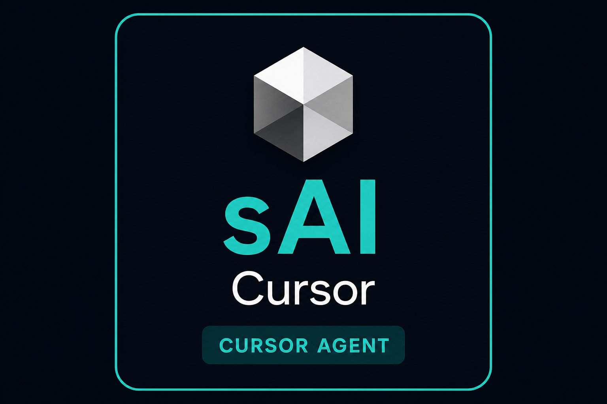

<p align="center">
  
</p>
<p align="center"><sub>sAI Solvrighn AI · Cursor track — same tile pattern as sAI Claude / sAI Gemini · <a href="branding/README.md">branding guide</a></sub></p>

<h1 align="center">SAI Cursor Validation</h1>

<p align="center">
  <sub><strong>sAI Solvrighn AI</strong> · Cursor track · A Revolution Lifecycle project</sub>
</p>

<p align="center">
  <strong>Transparency</strong> · <strong>Trust</strong> · <strong>Sustainability</strong> · <strong>Governance</strong> · <strong>Cooperative Intelligence</strong>
</p>

<p align="center">
  <a href="LICENSE"></a>
  <a href="https://github.com/Lightspeed-Engine/SAI-Cursor-Validation/actions/workflows/activity-correlator.yml"></a>
</p>

<p align="center">
  Open-source <strong>governed activity</strong> for <a href="https://cursor.com">Cursor</a> Agent — live operational truth on a timeline, not post-hoc narrative.
</p>

---

**sAI Solvrighn AI** · [github.com/Lightspeed-Engine/SAI-Cursor-Validation](https://github.com/Lightspeed-Engine/SAI-Cursor-Validation)

**Agents / devs pushing from this clone:** one-time [git auth setup](cursor/GIT-AUTH.md) via `.env.local` (not committed).

**Pre-commit (tests + 85% coverage):** `bash cursor/scripts/install-git-hooks.sh` — blocks commits that fail phase tests or coverage. Skip once: `git commit --no-verify`.

This repository delivers **Cursor Activity Correlator**: hooks append a project-local audit log (`.cursor/activity/activity.jsonl`); the **cursor-activity** VSIX shows what happened—tools, shell, edits—as the Agent runs. Same evidence-oriented goal as Claude Governor, adapted for Cursor (**no container**; hooks + log + extension).

---

## Why use this

| Problem | This project |
|---------|----------------|
| Agent claims “I ran tests / fixed the file” | **Hook-captured events** with timestamps |
| Post-hoc `git diff` vs chat story | **Live `activity.jsonl`** during the session |
| No IDE view of session truth | **`cursor-activity` VSIX** timeline panel |

**Governance here means operational truth first**—a shared timeline humans and policy can trust—aligned with the Lightspeed Engine values above.

---

## Install (users)

### 1. Hook kit (writes the log)

In your project:

```bash
git clone https://github.com/Lightspeed-Engine/SAI-Cursor-Validation.git
cd SAI-Cursor-Validation
bash cursor/scripts/install-project-hooks.sh /path/to/your-project
chmod +x /path/to/your-project/.cursor/hooks/append-activity.sh
```

Or copy manually: `cursor/hooks.json.example` → your repo `.cursor/hooks.json`, and wire `.cursor/hooks/append-activity.sh` (see [`cursor/README.md`](cursor/README.md)).

Reload Cursor, start an Agent session — log grows at `.cursor/activity/activity.jsonl`.

### 2. Extension (reads the log)

**From OpenVSX** (when published): search **Cursor Activity Correlator** in Extensions.

**From source / release:**

```bash
cd cursor-activity
npm ci && npm run compile && npm run package
```

In Cursor: **Extensions → … → Install from VSIX…** → select `cursor-activity/*.vsix`.

Or download `.vsix` from [GitHub Releases](https://github.com/Lightspeed-Engine/SAI-Cursor-Validation/releases).

---

## Repository layout

| Path | Purpose |
|------|---------|
| [`branding/`](branding/) | Lightspeed Engine Extensions brand assets |
| [`cursor/`](cursor/) | Hook scripts, design, plan, tests |
| [`cursor-activity/`](cursor-activity/) | VSIX — timeline UI, instruction context, git samples |
| [`.github/workflows/`](.github/workflows/) | CI: phase tests + release / OpenVSX / npm (when enabled) |

---

## Develop

```bash
git clone https://github.com/Lightspeed-Engine/SAI-Cursor-Validation.git
cd SAI-Cursor-Validation

# Regression (phases 0–2)
bash cursor/scripts/run-phase-tests.sh

# Live log check (after Agent session in this clone)
bash cursor/scripts/validate-live.sh

# Extension
cd cursor-activity && npm ci && npm run compile
# F5 in VS Code/Cursor from cursor-activity/
```

---

## Contributing

Contributions welcome — see [CONTRIBUTING.md](CONTRIBUTING.md).  
Use the [feature checklist](cursor/FEATURE-CHECKLIST-2026-05-18.md) for acceptance criteria.

---

## Docs

- [Design](cursor/DESIGN-2026-05-18-governed-activity-correlator.md)
- [Implementation plan](cursor/PLAN-2026-05-18-governed-activity-correlator.md)
- [Publishing / OpenVSX / CI](cursor/PUBLISHING.md)

---

## License

[MIT](LICENSE) — LightSpeed Engine.
