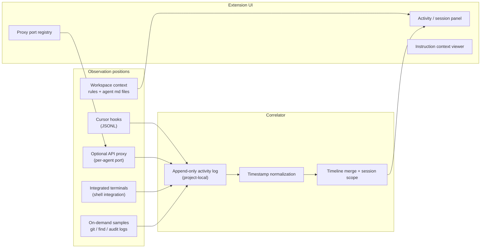
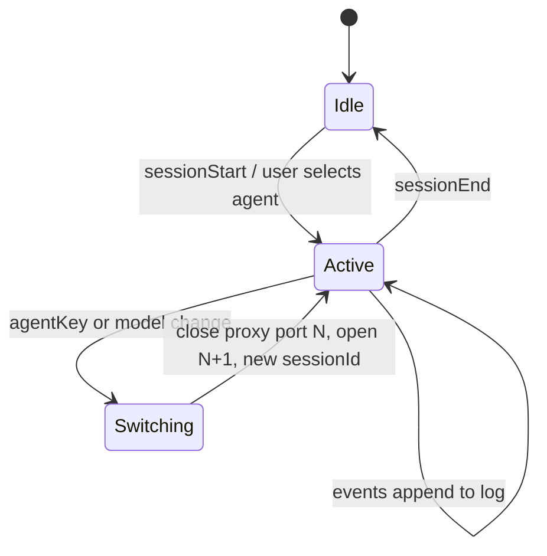

# DESIGN: Governed Activity Correlator (Cursor-first)

**Date:** 2026-05-18  
**Status:** Draft — implementation planning  
**Location:** `sai-extensions/cursor/`  
**Relates to:** [DEC-2026-04-25-governed-runtime-sdk-extension-ecosystem](file:///mnt/lightspeed-data/Lightspeed-Engine/LSE-StandAlone-Deployment/REALIGNMENT-2026-04-19/architecture/DEC-2026-04-25-governed-runtime-sdk-extension-ecosystem.md) (product-first extensions; Cursor adapter deferred there, addressed here)  
**Implementation plan:** [PLAN-2026-05-18-governed-activity-correlator.md](./PLAN-2026-05-18-governed-activity-correlator.md)

---

## 1. Problem

Governance and validation today lean on **post-hoc narrative** (agent claims, checkpoint text, regex over terminal buffers). That does not prove **what actually happened** during a session: which tools ran, what shell returned, what files changed, or under which model/agent profile.

The goal is **live operational truth**: multiple independent observation positions, correlated on a **shared timeline**, surfaced in the IDE for humans and downstream policy—not a single “did the paragraph match `git`?” check.

---

## 2. Goals

| Goal | Description |
|------|-------------|
| **Multi-source activity** | Tool use, shell, file edits, optional API proxy, sampled repo state |
| **Time alignment** | Every event carries a monotonic / wall-clock timestamp for correlation |
| **No file watchers** | Avoid workspace-wide `fs.watch`; use hooks, commands, and explicit samples |
| **Cursor-native path** | Use Cursor hooks as the primary agent feed where the built-in Agent/Composer has no extension API |
| **Human context** | Show workspace instruction surfaces (`CLAUDE.md`, `AGENTS.md`, `.cursor/rules`, etc.) without claiming one governance source for all agents |
| **Agent boundaries** | On agent or model change, close prior observation context and start a new one (e.g. dedicated proxy port per active agent profile) |

## 3. Non-goals (this design)

- Replacing Cursor’s Agent/Composer runtime or intercepting its private UI protocol
- LSE Control Plane, SigChain, or portal-gateway as **required** dependencies for v0
- A shared `@agent-governance/*` NPM monorepo **before** a working Cursor + one-CLI path (per DEC amendment)
- File-system watchers over large trees
- Proving correctness from agent prose alone

---

## 4. Architecture overview



**Principle:** Collectors are dumb appenders; the extension (or a small library it owns) correlates and presents. Enforcement/policy stays pluggable later (local rules, external provider)—not in v0.

---

## 5. Observation positions

### 5.1 Cursor hooks (primary for in-IDE Agent)

Project or user hooks (`.cursor/hooks.json` + scripts) receive JSON on stdin and should **append one JSON line per event** to a project-local log (e.g. `.cursor/activity/activity.jsonl`).

Hook script templates live under **`cursor/scripts/hooks/`** in this repo (copy into project `.cursor/hooks/`).

| Hook event | Use |
|----------|-----|
| `sessionStart` / `sessionEnd` | Session boundaries; trigger proxy lifecycle |
| `beforeSubmitPrompt` / `afterAgentResponse` | Prompt/response audit |
| `preToolUse` / `postToolUse` / `postToolUseFailure` | Tool calls and results |
| `beforeShellExecution` / `afterShellExecution` | Shell command + outcome |
| `beforeMCPExecution` / `afterMCPExecution` | MCP tool audit |
| `afterFileEdit` | Post-edit disk truth |
| `subagentStart` / `subagentStop` | Task/subagent scope |

**Note:** Documented Cursor fields include `model`, `conversation_id`, `session_id`, `composer_mode` (no separate `agentId`). See [SPIKE-2026-05-18-hooks.md](./SPIKE-2026-05-18-hooks.md); confirm on your Cursor build with a live Agent session.

### 5.2 Optional API proxy

When the user routes model traffic through a local proxy:

- One **listen port per active agent profile** (registry in extension state).
- Log: method, path, model headers, tool-related request shapes—not necessarily full bodies in v0.
- On **explicit** agent/model change (from hooks `sessionStart` or extension UI): drain/close old listener, start new port, tag subsequent events with `sessionId` + `agentKey`.

Proxy alone is **insufficient** (no shell, no local edits); it complements hooks.

### 5.3 Integrated terminals

For CLI-backed runtimes (`claude`, `codex`, `gemini`, etc.) and human shells:

- Reuse patterns from `claude-governor` / `claude-code` (PTY + buffer or shell integration API).
- Emit `terminal.command` / `terminal.output` events into the same JSONL schema.

### 5.4 On-demand samples (no watchers)

Triggered by hook milestones, user command, or checkpoint:

- `git status` / `git diff` (scoped paths)
- Time-window `find` (e.g. `-mmin`) for artifact discovery
- Optional read of known audit logs (e.g. quarantine logs) when configured

Each sample is an event: `{ "type": "sample.git_diff", "ts", "payload": { ... } }`.

### 5.5 Workspace instruction context (display only)

Read and show (not enforce):

- `CLAUDE.md`, `AGENTS.md`, `CONTRIBUTING.md` (configurable list)
- `.cursor/rules/**`, `.cursor/skills/**` (paths exist → listed)
- Project `hooks.json` presence

**No claim** that Cursor Agent loads the same set as Claude Code CLI.

---

## 6. Normalized event schema (v0)

All sources append to the same log format:

```json
{
  "v": 1,
  "ts": "2026-05-18T12:34:56.789Z",
  "source": "cursor.hook.postToolUse",
  "sessionId": "uuid-or-opaque",
  "agentKey": "composer|claude-cli|manual",
  "type": "tool.result",
  "payload": {}
}
```

| Field | Rule |
|-------|------|
| `v` | Schema version |
| `ts` | ISO-8601 UTC from collector; extension may add `receivedAt` |
| `source` | Namespaced producer id |
| `sessionId` | From hook session or extension-generated |
| `agentKey` | Stable id for correlator + proxy port map |
| `type` | Dot-separated taxonomy (`tool.start`, `shell.after`, `sample.git_diff`, …) |
| `payload` | Source-specific; redact secrets in hook scripts |

**Redaction:** Hook scripts and proxy should strip API keys, tokens, and env dumps before append.

---

## 7. Extension responsibilities (`cursor-activity` VSIX)

| Concern | Owner |
|---------|--------|
| Tail / parse `activity.jsonl` | Extension |
| Timeline UI (filter by session, type, source) | Extension webview or tree |
| Proxy port registry + lifecycle | Extension |
| Workspace context panel | Extension |
| Trigger sample commands | Extension command palette |
| Hook installation docs / template | This folder: `hooks.json.example`, `scripts/hooks/` |

The extension does **not** need to implement governance verdicts in v0; it proves **what happened** and **when**.

---

## 8. Session and agent lifecycle



- **Switching** must not merge unrelated traffic on one proxy port.
- Correlator UI shows current `agentKey`, port, `sessionId`, and event rate.

---

## 9. Relationship to existing packages

| Package | Today | This design |
|---------|--------|-------------|
| `claude-governor` | Richest: governance, checkpoints, `verifyClaim`, terminal | Reuse terminal + doc-read patterns; optional bridge hook events into same schema |
| `claude-code` | Terminal + UI, no governance module | Same bridge |
| `codex-governor` | Webview + terminal + regex governance | Align event schema; replace regex-only truth over time |
| `gemini-code`, `opencode-runtime`, `copilot-code` | Thin terminal wrappers | Adapters append to shared log when CLI is host |
| **`cursor/`** (this folder) | Design + plan + hook templates | Canonical Cursor track; future `cursor-activity` VSIX scaffold |

Extract `governor-core` **only** when two packages share identical log/tail/correlate code (DEC-aligned).

---

## 10. Security and privacy

- Activity log default: **project-local**, gitignored (`.cursor/activity/`).
- Document opt-in for team-shared logs.
- Hook scripts run with user permissions—treat log as sensitive.
- Proxy must not log full secrets; configurable body truncation.

---

## 11. Success criteria (v0)

1. Opening a Cursor project with hooks installed produces a growing `activity.jsonl` during a normal Agent session (tool + shell events visible).
2. Extension panel shows a merged timeline for the current `sessionId`.
3. Changing agent profile (or simulated via UI) rotates proxy port and labels events correctly.
4. User can run “sample git diff” and see result as a timeline event.
5. Instruction context panel lists detected rules/agent md files without implying Cursor loads them all.

---

## 12. Open questions

1. Which `sessionStart` fields does Cursor send for **model** and **agent mode**?
2. Can multiple concurrent Agent tabs map to distinct `sessionId`s?
3. OpenVSX/Theia: hooks equivalent or CLI-only collection?
4. Retention policy for `activity.jsonl` (size cap, rotation)?

---

## 13. References

- Cursor hooks: project `.cursor/hooks.json`, user `~/.cursor/hooks.json`
- Agent transcripts (audit, not live): `~/.cursor/projects/<id>/agent-transcripts/`
- Existing terminal/governance patterns: `claude-governor/`, `codex-governor/`
